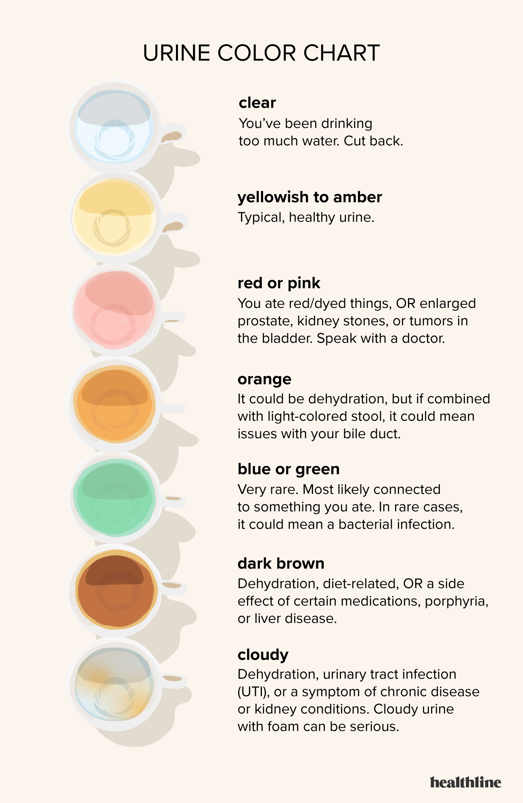

# Week 8 Learn Together

For this week's learn together I made a urine checker if you either have a healthy urine or not. I think this is helpful because we can check if we are drinking enough water everyday. I also included the chart where I got the information.

